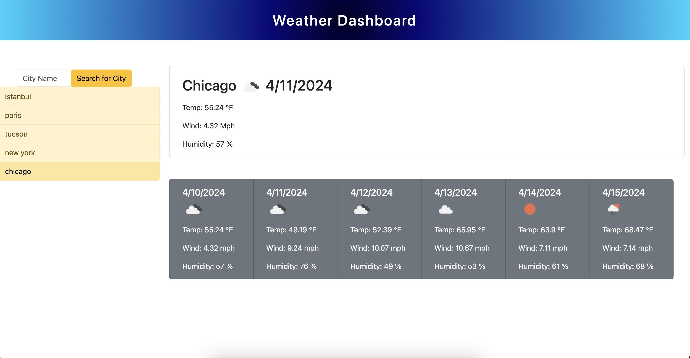

# weather-forecast

## What Is A Weather Forecast App?
* A weather forecast app is a digital application designed to provide users with up-to-date information about current weather conditions, as well as forecasts for the future.

## Description
* This is a weather forecast app that allows users to search for a city and view the current weather conditions as well as a 5-day forecast for that city.

## Usage 
* When you enter the application, you will see the weather forecast for the default city. To view the weather forecast for a different city, simply enter the city name on the left side of the page, click on the 'Search For City' button, and the weather forecast for the selected city will appear. You can search again to see the weather forecast for another city, and the cities you have previously searched for will appear as a list.

## Application Page

## Links

* [Github Repository](https://github.com/veyselarslan12/weather-forecast)

* [Deployment Website Link](https://veyselarslan12.github.io/weather-forecast/)
